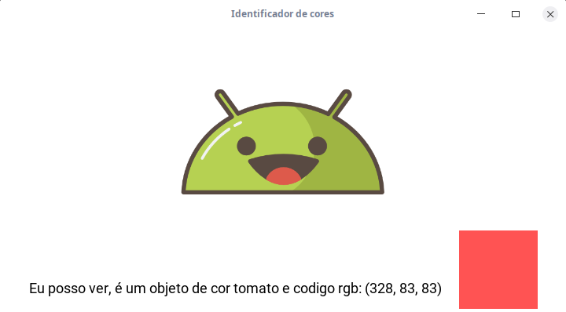
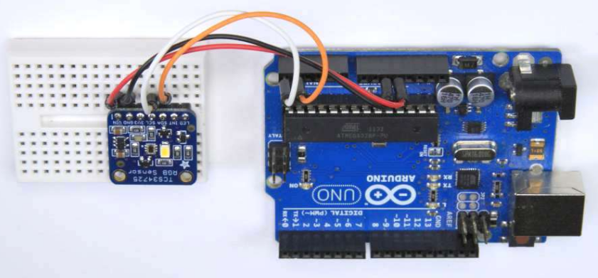
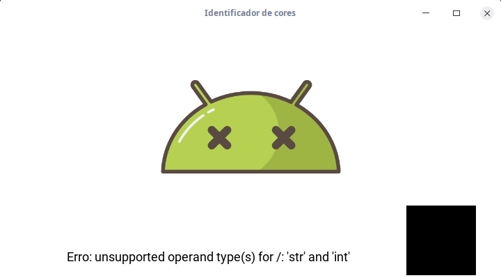
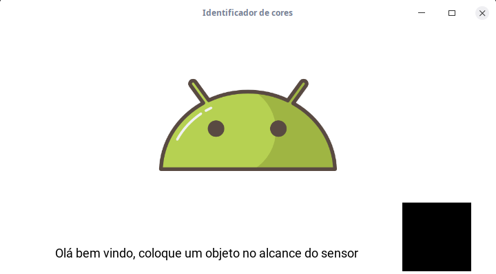

#Reconhecimento de cores com Kivy e sensor TCS34725 

Este projeto destina-se a trabalhar com o sensor de cor TCS34725 junto do framework Kivy. Para isso a aplicação se comunica com um arduino que esta conectado ao TCS34725 e envia periodicamente um valor da cor reconhecida no padrão RGB.



##Instalando os requisitos
Para rodar a aplicação é necessário instalar os requisitos presentes no arquivo *requirements.txt*, antes tenha certeza de ter o python instalado na versão 3.5 ou superior e crie um ambiente virtual com o Virtualenv. Em seguida atualize a versão do gerenciador de pacotes do Python:

```
pip install --upgrade pip
```
Pronto, agora já podemos instalar as dependências, vamos executar o seguinte comando dentro do diretorio onde contem os arquivos do projeto:
```
pip install -r requirements.txt

```
Em seguida carregue o código no arduino contido na pasta *Arduino* e monte o sensor seguindo a seguinte configuração:



##Rodando a aplicação
Com tudo configurado, conecte o arduino, abra uma janela no terminal e acesse o diretório da aplicação, inicie o ambiente virtual e em seguida rode o comando:

```
python main.py
``` 
Pronto, você deve ver uma janela semelhante a esta:


###Telas da aplicação
Caso tenha algum erro durante a execução a tela muda e apresentará o erro encontrado:


Se o arduino não estiver conectado ou a porta não estiver correta a tela apresentada será esta:


Nesse caso, basta ir na classe SerialControler e alterar a porta.

##Obrigado por chegar até o fim deste pequeno tutorial, sinta-se a vontade para explorar a aplicação e aprender mais!


*Os icones utilizados neste projeto foram obtidos no site https://icon-icons.com/pt/*